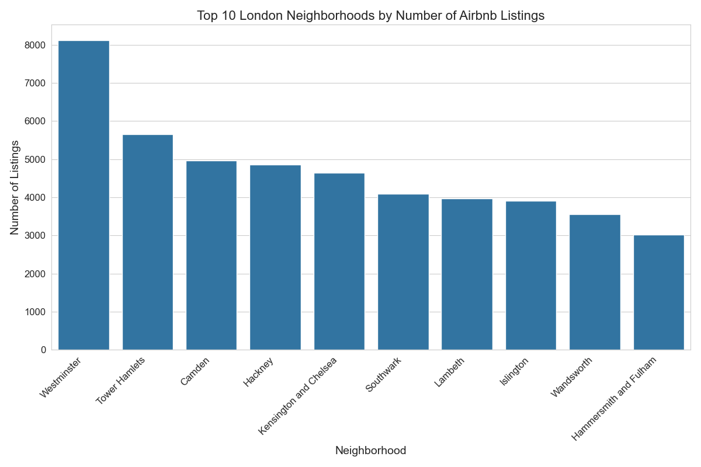
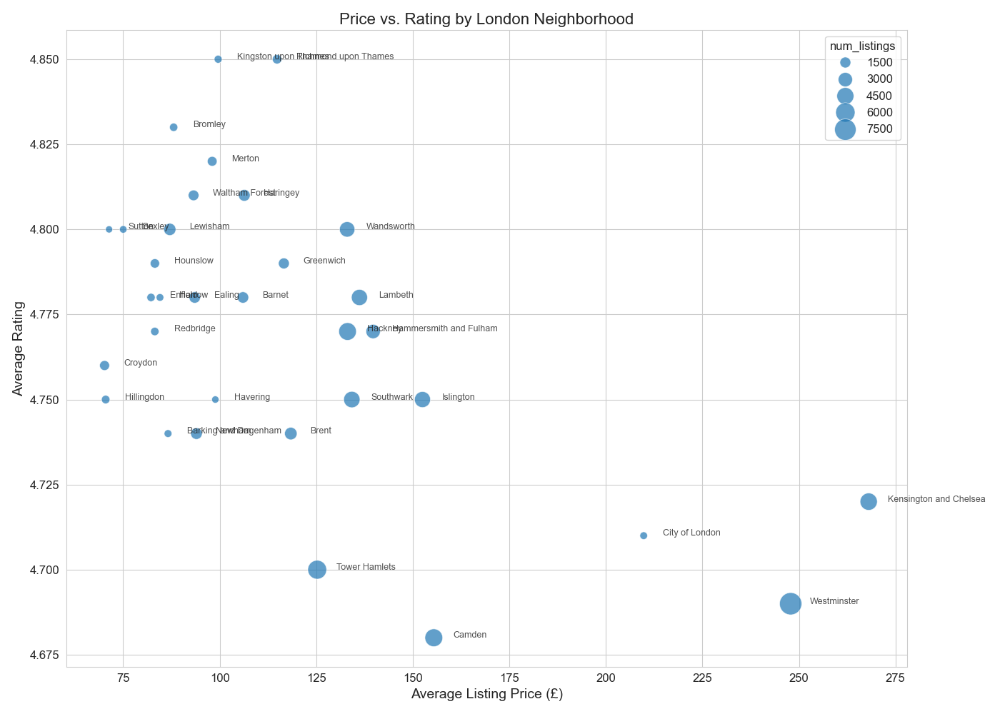
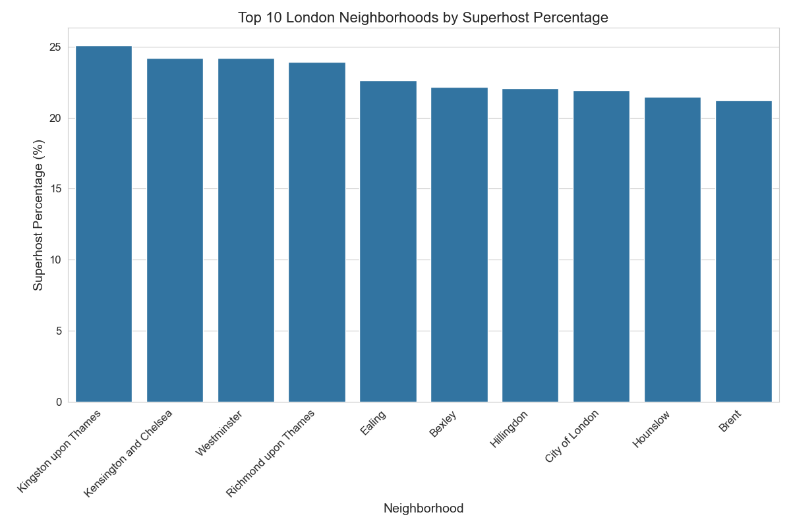

# London Airbnb Market Analysis

## Project Overview
This project analyzes Airbnb data across London neighborhoods to understand market dynamics, pricing patterns, and host behaviors using SQL and Python.

## Data Sources
- **Listings**: 92,159 unique properties across London
- **Reviews**: 1.9 million customer reviews
- **Calendar**: 34.7 million daily availability records
- **Neighborhoods**: 33 London boroughs

## Key Findings
- Westminster has the highest concentration of listings
- Kensington & Chelsea commands premium pricing
- Neighborhoods with higher superhost percentages show better review scores

## Project Structure
- `sql/`: SQL queries for data analysis
- `scripts/`: Python scripts to run queries and generate visualizations
- `results/`: CSV outputs from SQL queries
- `visualizations/`: Charts and graphs generated from analysis

## Tools Used
- PostgreSQL for data storage and complex queries
- Python (pandas, matplotlib, seaborn) for data analysis and visualization
- VS Code for development environment

## How to Run
1. Set up PostgreSQL database with Airbnb data
2. Create a `.env` file with database credentials
3. Run `python scripts/run_query.py` to execute SQL and save results
4. Run `python scripts/visualize.py` to generate visualizations

## Visualizations

## Author
Gabriele Vertullo

## License
This project is licensed under the MIT License - see the LICENSE file for details.