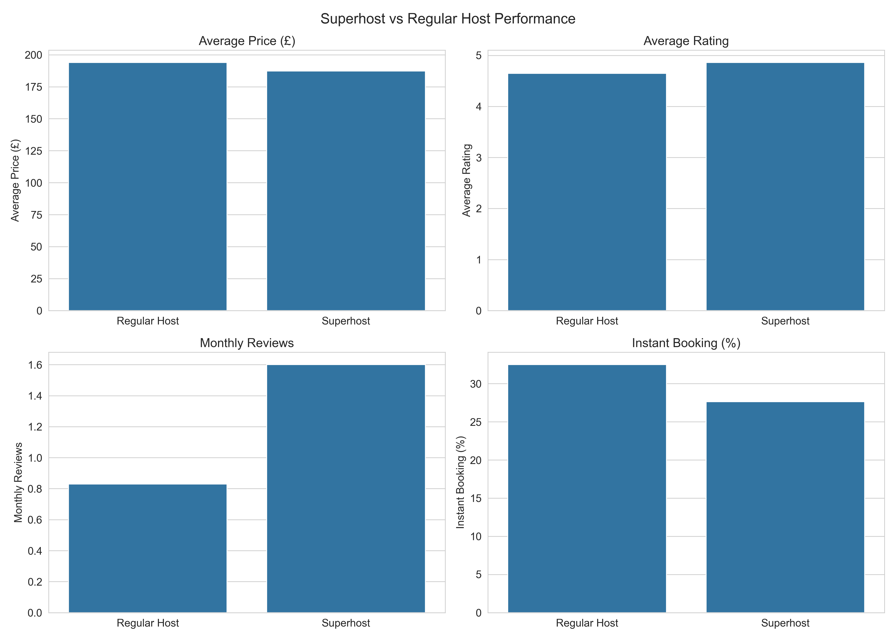
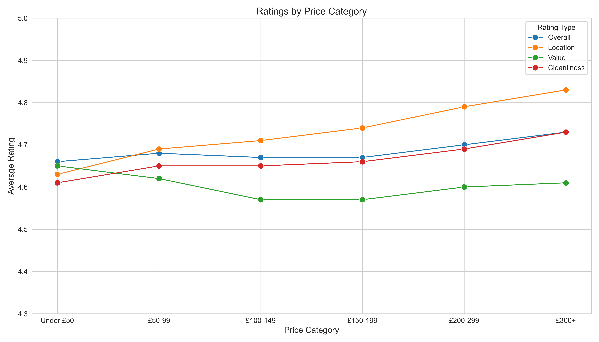

# London Airbnb Market Analysis

## Project Overview
This project analyzes Airbnb data across London neighborhoods to understand market dynamics, pricing patterns, and host behaviors using SQL and Python.

## Data Sources
- **Listings**: 92,159 unique properties across London
- **Reviews**: 1.9 million customer reviews
- **Calendar**: 34.7 million daily availability records
- **Neighborhoods**: 33 London boroughs

## Analysis Areas

### 1. Neighborhood Performance Analysis

- Compared all 33 London neighborhoods on various performance metrics
- Identified highest concentration of listings and pricing trends by area
- Analyzed review volumes, ratings, and superhost percentages

### 2. Property Type Analysis

- Analyzed different property types by price, rating, and availability
- Identified which property types command premium pricing
- Compared superhost presence across different property types

### 3. Seasonal Trends

- Examined pricing fluctuations throughout the year
- Identified high and low seasons for London Airbnb market
- Analyzed availability patterns by month

### 4. Review Sentiment Analysis

- Analyzed positive and negative keywords in reviews
- Calculated positive-to-negative mention ratios by neighborhood
- Identified areas with strongest and weakest sentiment

### 5. Superhost Performance Analysis

- Compared superhosts vs. regular hosts on key metrics
- Analyzed pricing strategy differences
- Identified review volume and rating advantages

### 6. Availability Patterns

- Identified neighborhoods with highest and lowest availability
- Analyzed booking patterns across different areas
- Compared supply-demand balance by location

### 7. Stay Duration Analysis

- Examined minimum night requirements across neighborhoods
- Identified areas popular for one-night stays vs. longer stays
- Analyzed relationship between stay duration and pricing

### 8. Price-Rating Correlation

- Analyzed how different price points affect ratings
- Compared value perception across price categories
- Identified optimal price points for highest ratings

### 9. Top vs Bottom Neighborhoods

- Compared highest and lowest rated neighborhoods
- Analyzed price-quality relationship
- Identified outliers and high-value areas

### 10. Host Portfolio Analysis

- Examined how portfolio size affects host performance
- Compared professional hosts vs. occasional hosts
- Analyzed pricing strategies by portfolio size

## Tools Used
- PostgreSQL for data storage and complex queries
- Python (pandas, matplotlib, seaborn) for data analysis and visualization
- VS Code for development environment

## How to Run
1. Set up PostgreSQL database with Airbnb data
2. Create a `.env` file with database credentials
3. Run `python scripts/run_all_queries.py` to execute all SQL queries
4. Run `python scripts/visualize_all.py` to generate visualizations

## Author
Gabriele Vertullo

## License
This project is licensed under the MIT License - see the LICENSE file for details.